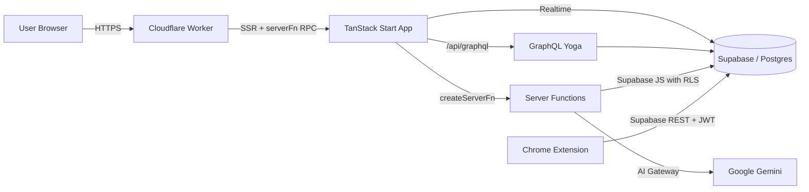
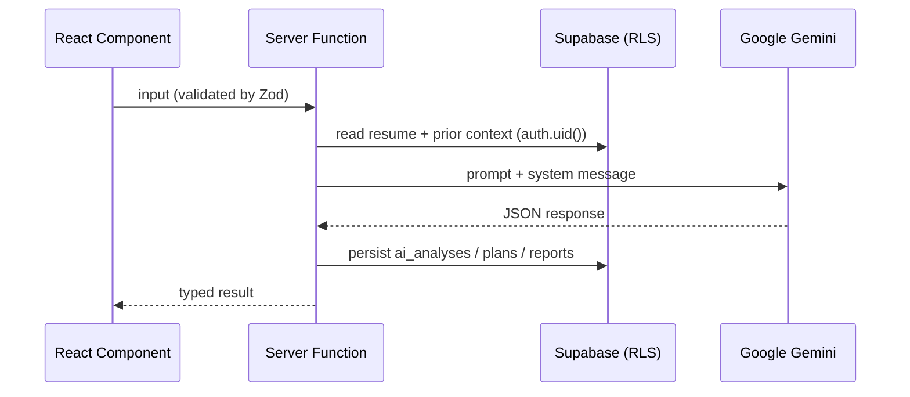
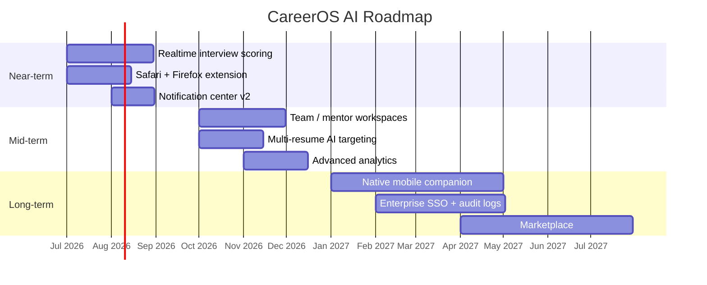

<div align="center">

# CareerOS AI

**The AI-native operating system for your job search.**

Plan your career, tailor your resume, ace mock interviews, and track every
application — all in one edge-deployed workspace with an official Chrome
extension and a first-class GraphQL API.

[](https://tanstack.com/start)
[](https://react.dev)
[](https://vitejs.dev)
[](https://www.typescriptlang.org)
[](https://tailwindcss.com)
[](https://workers.cloudflare.com)
[](https://supabase.com)
[](#license)

[Live demo](https://careeros.app) ·
[Documentation](./docs/README.md) ·
[Chrome extension](./extension/README.md) ·
[GraphQL API](./src/lib/graphql/README.md)

</div>

---

## Overview

CareerOS AI is a production-grade career workspace built for the modern job
seeker. It combines a personalised **AI Career Coach**, a full-fidelity **AI
Mock Interview Studio**, **Resume Analysis & Matching**, an **Applications
Tracker**, a **Chrome extension** for one-click job capture, and a **GraphQL
API** for programmatic access — behind a single Supabase-authenticated
account.

The app runs SSR on **Cloudflare Workers** via **TanStack Start**, uses
**Supabase (Supabase)** for data and auth, and routes AI calls through
the **Google Gemini** so every model (Gemini, GPT, …) is one config
change away.

## Features

- **AI Career Coach** — weekly & monthly roadmaps, goal tracking, skill
  inventory, progress dashboard, and personalised recommendations for
  learning, internships, companies, technologies, and certifications.
- **AI Mock Interview Studio** — HR, technical, behavioural, system design,
  product, and coding interviews with voice + webcam, per-turn scoring,
  downloadable feedback reports, and long-term trend dashboards.
- **AI Resume Analyzer & Job Match** — deep analysis, ATS scoring, resume
  comparison, and role-specific match reports.
- **AI Cover Letter & Interview Coach** — generate tailored letters and
  STAR-formatted answers grounded in the user's active resume.
- **Applications Tracker** — kanban + list views with smart search
  (`status:offer company:acme`), saved filters, drafts, deadlines,
  follow-ups, and referral tracking.
- **Interview Notes & Referrals** — persistent per-application notes and
  referral request pipeline.
- **Chrome Extension** — one-click "Save to CareerOS" from LinkedIn,
  Wellfound, Internshala, Naukri, Indeed, Glassdoor, Greenhouse, Lever,
  and Ashby.
- **GraphQL API** — Relay-style pagination, filtering, sorting, DataLoader
  batching, GraphiQL playground, JWT-authenticated with RLS enforcement.
- **Enterprise-grade security** — Row-Level Security on every table, roles
  in a separate `user_roles` table, service-role isolation, and per-row
  ownership policies.

## Tech Stack

| Layer | Stack |
| --- | --- |
| Framework | TanStack Start (React 19, Vite 7) |
| Language | TypeScript (strict) |
| Styling | Tailwind CSS v4, shadcn/ui (New York) |
| Data | Supabase (Supabase Postgres + Auth + Storage) |
| APIs | TanStack server functions (RPC), GraphQL Yoga at `/api/graphql` |
| AI | Google Gemini (Gemini, GPT-family) |
| Runtime | Cloudflare Workers with `nodejs_compat` |
| Extension | Manifest V3, TypeScript, bun-bundled |
| Tooling | Bun, ESLint, Prettier, tsgo |

## Folder Structure

```
careeros-ai/
├── docs/                     Architecture, DB, API, deployment, security, roadmap
├── extension/                Manifest V3 Chrome extension (source + build)
├── public/                   Static assets, packaged extension zip
├── src/
│   ├── components/           App shell, command palette, shadcn/ui primitives
│   ├── features/
│   │   ├── ai/               ai.functions.ts (analyzer, coach, cover letter, match)
│   │   ├── applications/     utils.ts (filters, drafts, smart search)
│   │   ├── career/           career.functions.ts (roadmaps, goals, skills)
│   │   ├── mock-interview/   mock-interview.functions.ts (sessions, scoring)
│   │   └── resumes/          resumes.functions.ts + use-active-resume hook
│   ├── integrations/
│   │   └── supabase/         Generated client + auth middleware + admin client
│   ├── lib/
│   │   ├── graphql/          Schema, resolvers, pagination, Yoga server
│   │   ├── format.ts         Status labels, colors, dates
│   │   ├── error-*.ts        SSR error capture + friendly error page
│   │   └── utils.ts          cn() helper
│   ├── routes/               File-based routes (pages + /api/graphql)
│   ├── router.tsx            TanStack Router config
│   ├── server.ts             Worker entry
│   └── start.ts              TanStack Start instance + middleware
└── supabase/migrations/      Schema, RLS, GRANTs
```

## Architecture



Deep dive: [docs/architecture.md](./docs/architecture.md) ·
[docs/database.md](./docs/database.md) ·
[docs/api.md](./docs/api.md).

## Installation

**Requirements:** Bun ≥ 1.1, Node ≥ 20 (for tsgo), a Supabase
project (Supabase) or your own Supabase project.

```bash
# 1. Install dependencies
bun install

# 2. Configure environment variables (see next section)
cp .env.example .env   # then fill in the values

# 3. Run the dev server
bun run dev

# 4. Type-check and build
bunx tsgo --noEmit
bun run build
```

The app boots on `http://localhost:8080`. TanStack Router regenerates
`src/routeTree.gen.ts` automatically on file changes under `src/routes/`.

## Environment Variables

Managed by Supabase in production; set locally in `.env`.

| Variable | Where used | Purpose |
| --- | --- | --- |
| `VITE_SUPABASE_URL` | Browser | Supabase project URL. |
| `VITE_SUPABASE_PUBLISHABLE_KEY` | Browser | Anon/publishable key (safe in client). |
| `SUPABASE_URL` | Server | Same URL, read from `process.env` in server functions. |
| `SUPABASE_PUBLISHABLE_KEY` | Server | Publishable key for user-scoped server client. |
| `SUPABASE_SERVICE_ROLE_KEY` | Server (`.server.ts` only) | Admin client that bypasses RLS. |
| `GEMINI_API_KEY` | Server | Google Gemini credentials. |

Additional connector-provided secrets (e.g. `GOOGLE_MAIL_API_KEY`) are
injected automatically when you link a connection in the CareerOS UI.

## Screenshots

> Drop screenshots into `docs/screenshots/` and reference them here.
> Suggested captures:

| Surface | Path |
| --- | --- |
| Dashboard & analytics | `docs/screenshots/dashboard.png` |
| Applications tracker (kanban) | `docs/screenshots/applications.png` |
| AI Career Coach roadmap | `docs/screenshots/career-coach.png` |
| AI Mock Interview session | `docs/screenshots/mock-interview.png` |
| Resume analyzer report | `docs/screenshots/resume-analyzer.png` |
| Chrome extension popup | `docs/screenshots/extension.png` |

```markdown

```

## AI Features

Every AI surface runs through the Google Gemini from an authenticated
server function, with inputs validated via Zod and outputs persisted for
audit and continuity.

| Feature | Module | What it does |
| --- | --- | --- |
| Resume Analyzer | `features/ai/ai.functions.ts` | Strengths/gaps, ATS score, keyword coverage, action items. |
| Resume Comparison | `features/ai/ai.functions.ts` | Side-by-side diff of two resumes with recommendations. |
| Job Match | `features/ai/ai.functions.ts` | Role-specific match report from active resume + JD. |
| Cover Letter Generator | `features/ai/ai.functions.ts` | Tailored, tone-adjustable letters. |
| Interview Coach | `features/ai/ai.functions.ts` | STAR answers, question banks, per-answer scoring. |
| Career Coach | `features/career/career.functions.ts` | Weekly/monthly roadmaps, goals, skills, recommendations. |
| Mock Interview Studio | `features/mock-interview/mock-interview.functions.ts` | Multi-mode interviews with per-turn scoring and reports. |



## Chrome Extension

**Official CareerOS AI extension** (Manifest V3) — save any job posting to
your account in one click.

- **Supported portals:** LinkedIn, Wellfound, Internshala, Naukri, Indeed,
  Glassdoor, Greenhouse, Lever, Ashby.
- **Extraction:** JSON-LD `JobPosting` schema-org first, with per-portal
  DOM fallbacks. Captures company, role, location, salary, description,
  skills, recruiter, deadline, and apply URL.
- **Auth handshake:** the in-app `/extension` page forwards the current
  Supabase session to the extension's local storage — no re-login required.
- **Smart features:** duplicate detection (by URL or company+role),
  auto-tagging, and deep links into AI Job Match and Resume Match.

Build & load:

```bash
cd extension
bun install
bun run build           # outputs public/careeros-extension.zip
# In Chrome → chrome://extensions → Developer mode → Load unpacked
```

Full guide: [`extension/README.md`](./extension/README.md).

## GraphQL

A first-class GraphQL layer at **`POST /api/graphql`** (GET serves
GraphiQL). Coexists with the REST/RPC surfaces — same auth, same RLS.

- Relay-style cursor pagination, filtering, and whitelisted sort fields.
- DataLoader batching for profiles, applications, and resumes.
- Custom scalars: `DateTime`, `JSON`, `Cursor`.
- Modules: User, Applications, Resumes, Resume Analyses, Job Match,
  Interview Coach, Mock Interviews, Referrals, Notifications, Analytics.

```graphql
query MyApplications($first: Int!, $after: Cursor) {
  applications(first: $first, after: $after, orderBy: CREATED_AT_DESC) {
    edges { cursor node { id company role status createdAt } }
    pageInfo { hasNextPage endCursor }
  }
}
```

Full reference: [`src/lib/graphql/README.md`](./src/lib/graphql/README.md).

## Deployment

CareerOS builds to a standard TanStack Start bundle (`dist/client/` +
`dist/server/server.js`, a Web `fetch` handler). The same artefact runs on
**Vercel**, **Docker**, or any Node 20 host.

### Vercel

```bash
npm i -g vercel
vercel link
vercel --prod
```

`vercel.json` wires `bun run build` → static `dist/client/` + serverless
function at [`api/index.mjs`](./api/index.mjs). Configure environment
variables from [`.env.example`](./.env.example) in the Vercel dashboard
(the `VITE_*` ones must exist at build time).

### Docker

```bash
docker build -t careeros-app .
docker run --rm -p 8080:8080 --env-file .env careeros-app
# or
docker compose up --build
```

Multi-stage build (`bun` → `node:20-alpine`) with a tiny Node entry at
[`docker/server.mjs`](./docker/server.mjs) that serves static assets and
forwards SSR + API + GraphQL to the TanStack Start handler.

### Bare Node

```bash
bun install --frozen-lockfile
bun run build
node docker/server.mjs
```

Full details, per-target env matrix, and post-deploy verification steps
live in [docs/deployment.md](./docs/deployment.md).

## Roadmap



Full roadmap and non-goals: [docs/future-roadmap.md](./docs/future-roadmap.md).

## Documentation

| Document | Scope |
| --- | --- |
| [architecture.md](./docs/architecture.md) | System, modules, request lifecycle. |
| [database.md](./docs/database.md) | Schema, RLS, migrations, access model. |
| [api.md](./docs/api.md) | Server functions, GraphQL, extension APIs. |
| [deployment.md](./docs/deployment.md) | Pipeline, environments, runtime. |
| [security.md](./docs/security.md) | Threat model, authn/authz, secrets. |
| [future-roadmap.md](./docs/future-roadmap.md) | Near-, mid-, long-term plans. |

## Contributing

Issues and PRs are welcome. Please:

1. Open an issue describing the change.
2. Match the existing code style (`bunx prettier -w .` and `bunx tsgo --noEmit`).
3. Keep functionality untouched when doing refactors; ship features with
   migrations and RLS policies where applicable.

## License

Released under the [MIT License](./LICENSE). © CareerOS AI contributors.
