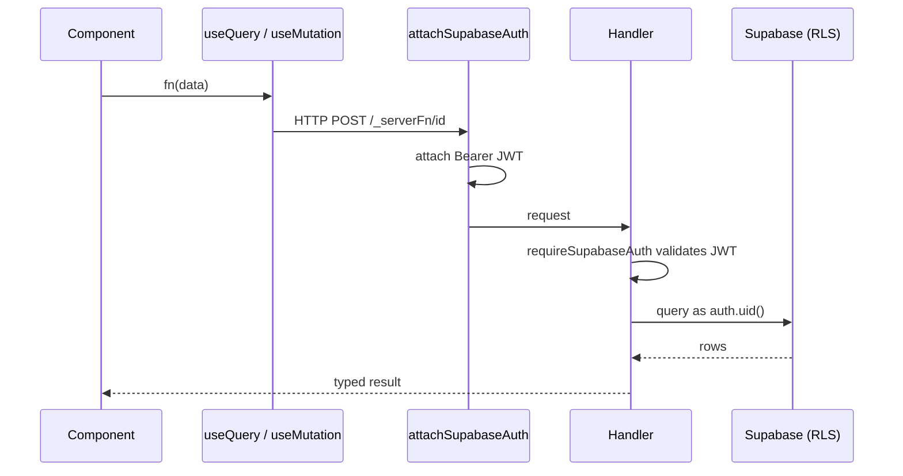

# API

CareerOS AI exposes three complementary surfaces:

1. **TanStack Server Functions (RPC)** — the primary way the app talks to
   its own backend. Fully typed end-to-end via `createServerFn`.
2. **GraphQL API** — an optional, schema-driven surface at `/api/graphql`
   backed by `graphql-yoga` and DataLoader.
3. **Supabase REST** — used directly by the Chrome extension with the
   user's session token, protected by RLS.

## Server Functions (Primary)

Located in `src/features/<domain>/*.functions.ts`. All authenticated
functions run through `requireSupabaseAuth`, which validates the JWT and
provides a caller-scoped Supabase client on `context`.

```ts
// src/features/ai/ai.functions.ts (excerpt)
export const analyzeResume = createServerFn({ method: "POST" })
  .middleware([requireSupabaseAuth])
  .inputValidator(analyzeResumeSchema.parse)
  .handler(async ({ data, context }) => {
    const { supabase, userId } = context;
    // ...
  });
```

### Domains

| Module | Selected functions |
| --- | --- |
| `features/ai` | `analyzeResume`, `compareResumes`, `matchJob`, `generateCoverLetter`, `interviewPrep`, `generateStarAnswer`, `scoreInterviewAnswer`, `careerCoach` |
| `features/career` | Weekly + monthly roadmap generation, goal + skill CRUD, progress dashboard queries |
| `features/mock-interview` | `startSession`, `nextQuestion`, `submitAnswer`, `finalizeSession`, `getReport`, history & trends |
| `features/resumes` | `getSharedResume`, active resume queries, share-link management |

### Calling Pattern

Server functions are invoked either from a `useQuery` in a component, or
via `useServerFn(fn)` for mutations. Public-route loaders MUST NOT call
protected functions — SSR prerender has no bearer token.



## GraphQL API

Endpoint: `POST /api/graphql` (GET serves the GraphiQL playground).
Documented in detail in `src/lib/graphql/README.md`.

### Authentication

Send the Supabase access token as a bearer:

```http
POST /api/graphql
Authorization: Bearer <supabase_access_token>
Content-Type: application/json
```

All resolvers use the caller's token, so RLS enforces the same rules as
the RPC surface.

### Capabilities

- Relay-style cursor pagination on every list.
- Filtering and whitelisted sort fields per entity.
- Custom scalars: `DateTime`, `JSON`, `Cursor`.
- DataLoader batching for profiles, applications, resumes.
- Modules for User, Applications, Resumes, Resume Analyses, Job Match,
  Interview Coach, Mock Interviews, Referrals, Notifications, Analytics.

### Example

```graphql
query MyApplications($first: Int!, $after: Cursor) {
  applications(first: $first, after: $after, orderBy: CREATED_AT_DESC) {
    edges { cursor node { id company role status createdAt } }
    pageInfo { hasNextPage endCursor }
  }
}
```

## Public Routes (`/api/public/*`)

Reserved for webhooks, cron, and third-party callers. Bypasses auth on
published sites and MUST verify caller identity inside the handler (HMAC,
shared secret, etc.). Currently unused; reserved for future integrations.

## Chrome Extension

The extension talks directly to Supabase REST using the user's session
token minted via the in-app `/extension` page. It writes to `applications`
respecting the same RLS policies as the web app; no bespoke backend
endpoint exists for the extension.

## Error Model

- Server functions throw typed `Error`s; TanStack surfaces them to the
  client via the query's `error` state.
- GraphQL returns standard `errors[]`; mutation results include partial
  data where safe.
- SSR crashes are captured by `src/server.ts` and rendered via
  `renderErrorPage()` — never a raw stack trace.
