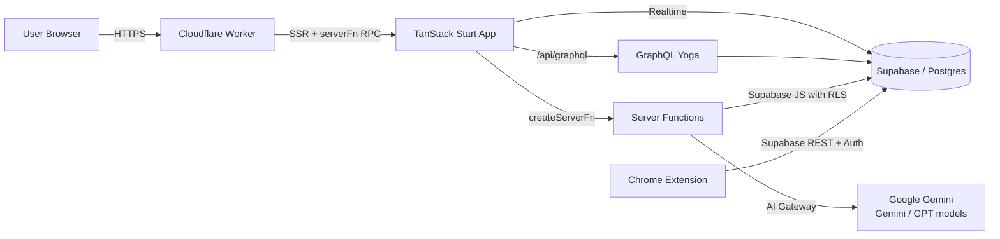
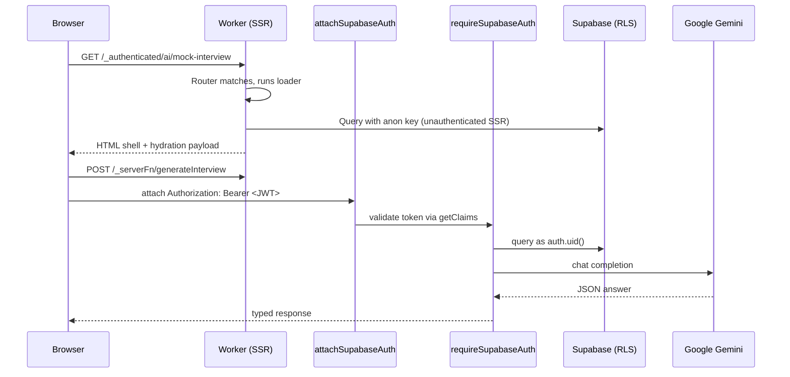

# Architecture

CareerOS AI is a full-stack, edge-deployed web application that helps job seekers
plan careers, tailor resumes, practice interviews, and track applications with the
help of AI. It runs on TanStack Start (React 19 + Vite 7) on Cloudflare Workers,
with Supabase (Supabase) as the managed backend.

## High-Level System



## Layered Design

- **Presentation** — React 19 components under `src/routes/` (file-based
  routing) and shared UI in `src/components/`. Styling via Tailwind v4 tokens
  in `src/styles.css`.
- **Feature modules** — domain logic grouped under `src/features/<domain>/`
  (ai, career, resumes, applications, mock-interview). Each module owns its
  server functions, hooks, and helpers.
- **Server functions** — `createServerFn` handlers in `*.functions.ts`
  provide typed RPC. Authenticated handlers use `requireSupabaseAuth`
  middleware to receive a scoped Supabase client bound to the caller's JWT.
- **GraphQL layer** — `graphql-yoga` mounted at `/api/graphql` co-exists
  with RPC endpoints, honouring the same RLS rules via the caller's bearer
  token.
- **Data & Auth** — Supabase Postgres with Row-Level Security; Supabase Auth
  for session issuance (email + Google OAuth).
- **AI layer** — Google Gemini called from server functions for chat,
  scoring, planning, and interview generation.

## Repository Layout

```
src/
  components/         Shared UI (app shell, command palette, theme, ui/*)
  features/
    ai/               ai.functions.ts (analyzer, coach, cover letter, match)
    career/           career.functions.ts (roadmaps, goals, tracking)
    mock-interview/   mock-interview.functions.ts (sessions, scoring, reports)
    resumes/          resumes.functions.ts + use-active-resume hook
    applications/     utils.ts (filters, drafts, search)
  integrations/
    supabase/         Generated client, auth middleware, admin client
  lib/
    graphql/          Schema, resolvers, pagination, Yoga server
    format.ts         Status labels, colors, dates
    error-*.ts        Error page + SSR error capture
    utils.ts          cn() helper
  routes/             File-based routes (pages + /api/graphql)
extension/            Manifest V3 Chrome extension (job capture)
supabase/migrations/  SQL migrations (schema, RLS, grants)
docs/                 This documentation
```

## Request Lifecycle



## Feature Modules

```mermaid
graph TD
    subgraph Frontend
      R[Routes] --> C[Components]
      R --> F[Feature Modules]
    end
    F --> AI[ai.functions.ts]
    F --> CAR[career.functions.ts]
    F --> MI[mock-interview.functions.ts]
    F --> RES[resumes.functions.ts]
    F --> APP[applications/utils]
    AI --> GW[Google Gemini]
    CAR --> DB[(Supabase)]
    MI --> DB
    MI --> GW
    RES --> DB
    APP --> DB
    R --> GQL[/api/graphql]
    GQL --> DB
```

## Runtime & Build

- **Runtime**: Cloudflare Workers with `nodejs_compat`. All Node built-ins
  used by the app (`crypto`, `stream`, `Buffer`) are Worker-safe. Native
  addons and subprocesses are forbidden.
- **Build**: Vite 7 via `@github.com/vite-tanstack-config`. The router
  plugin generates `src/routeTree.gen.ts`; the server-function transformer
  extracts handler bodies from client bundles.
- **Rendering**: SSR by default; client hydration through TanStack Router.
  Public-route loaders never call auth-protected server functions
  (prerender has no session).

## Chrome Extension

A Manifest V3 companion that scrapes JobPosting JSON-LD (with per-portal
fallbacks) and POSTs directly to Supabase REST using the user's session,
which is minted by the in-app `/extension` page. See `extension/README.md`
for build instructions.
