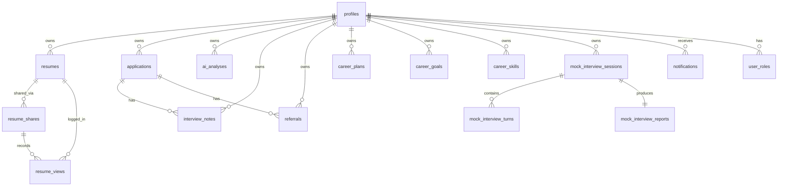
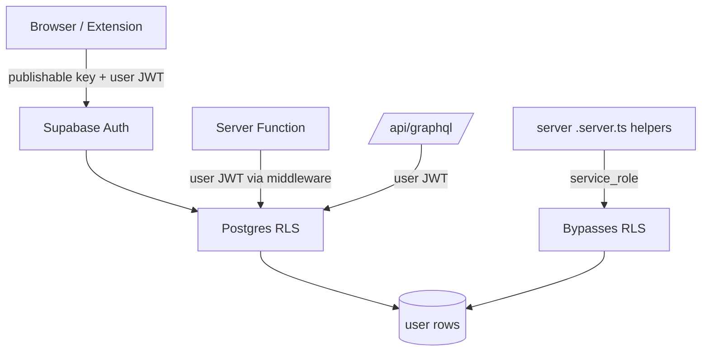

# Database

CareerOS AI uses Supabase (Postgres) as the system of record. Every table
lives in the `public` schema, has Row-Level Security enabled, explicit `GRANT`
statements, and policies keyed on `auth.uid()`.

## Schema Overview



## Core Tables

| Table | Purpose |
| --- | --- |
| `profiles` | Public profile for each auth user; created on signup. |
| `user_roles` | Role assignments (`admin`, `moderator`, `user`) — separate table to prevent privilege escalation. |
| `resumes` | Uploaded resumes with extracted text, active flag, and metadata. |
| `resume_shares` | Public share slugs with optional expiry. |
| `resume_views` | Analytics for share opens (public inserts, owner-only reads). |
| `applications` | Job applications with status, deadlines, salary, recruiter. |
| `interview_notes` | Notes captured during interview rounds. |
| `referrals` | Referral requests linked to applications. |
| `ai_analyses` | Persisted outputs from AI tools (resume analysis, cover letters, matches). |
| `career_plans` | Weekly + monthly roadmaps generated by the Career Coach. |
| `career_goals` | User goals with progress tracking. |
| `career_skills` | Skill inventory with current + target levels. |
| `mock_interview_sessions` | Per-session config (company, role, type, mode). |
| `mock_interview_turns` | Question/answer pairs with per-turn scoring. |
| `mock_interview_reports` | Aggregated feedback, scores, and study plans. |
| `notifications` | User-facing notification feed. |

## Row-Level Security Pattern

Every user-facing table follows the same shape:

```sql
CREATE TABLE public.<table> ( id uuid primary key, user_id uuid not null, ... );

GRANT SELECT, INSERT, UPDATE, DELETE ON public.<table> TO authenticated;
GRANT ALL ON public.<table> TO service_role;

ALTER TABLE public.<table> ENABLE ROW LEVEL SECURITY;

CREATE POLICY "owner reads"   ON public.<table> FOR SELECT USING (auth.uid() = user_id);
CREATE POLICY "owner writes"  ON public.<table> FOR INSERT WITH CHECK (auth.uid() = user_id);
CREATE POLICY "owner updates" ON public.<table> FOR UPDATE USING (auth.uid() = user_id);
CREATE POLICY "owner deletes" ON public.<table> FOR DELETE USING (auth.uid() = user_id);
```

Public read paths (e.g. `resume_shares`) scope policies to unexpired,
non-revoked rows and never expose the underlying `user_id`. Role checks
use a `SECURITY DEFINER` `has_role(uid, role)` function to avoid recursive
RLS lookups.

## Access Model



The `service_role` client is loaded lazily inside `.server.ts` helpers and
only used for verified webhooks, background maintenance, and privileged
admin operations after the caller has been authorized.

## Migrations

All schema changes ship as timestamped SQL files under
`supabase/migrations/`. Each migration is idempotent-safe where possible
and always contains, in order: `CREATE TABLE`, `GRANT`, `ALTER TABLE ...
ENABLE ROW LEVEL SECURITY`, and `CREATE POLICY`.
