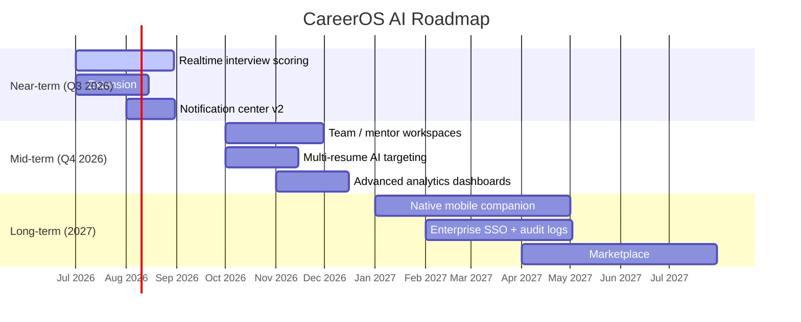
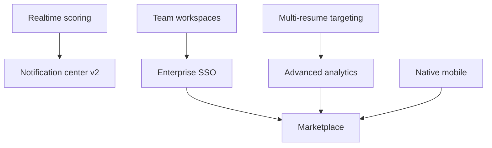

# Future Roadmap

This roadmap captures near-, mid-, and long-term investments. Priorities are
directional; sequencing is adjusted per user feedback and platform capacity.

## Timeline

## Near-Term (Q3 2026)

- **Realtime interview scoring** — stream partial transcripts and score
  answers turn-by-turn instead of at session end.
- **Extension parity for Safari and Firefox** — port the MV3 extension
  using WebExtensions polyfills; unify job extractors.
- **Notification center v2** — grouped, actionable notifications with
  in-app preferences and email digests.

## Mid-Term (Q4 2026)

- **Team / mentor workspaces** — shared applications, feedback threads,
  and permissions using an extended `user_roles` model.
- **Multi-resume AI targeting** — automatically select the strongest
  resume variant per job and generate tailored diffs.
- **Advanced analytics** — funnel analytics (saved -> applied -> OA ->
  interview -> offer), cohort comparisons, and geographic breakdowns.

## Long-Term (2027)

- **Native mobile companion** — an Expo-based client that reuses the
  GraphQL surface for offline-friendly access.
- **Enterprise SSO + audit logs** — SAML / OIDC providers, per-tenant
  data isolation, and exportable audit trails.
- **Marketplace** — vetted coaches, resume templates, and interview
  question packs with revenue sharing.

## Cross-Cutting Investments

- **Observability**: OpenTelemetry traces from Worker -> Supabase ->
  AI Gateway; per-user latency dashboards.
- **Cost controls**: per-user AI budgets, model routing by task, and
  caching of deterministic prompts.
- **Compliance**: SOC 2 controls, DPA templates, and regional data
  residency options.
- **Accessibility**: WCAG 2.2 AA audit + remediation across the app.

## Feature Dependency Map

## Non-Goals (for now)

- Replacing the REST/GraphQL surfaces with a bespoke protocol.
- Self-hosted deployments outside Supabase.
- Fine-tuned proprietary models — we route to hosted providers via the
  Google Gemini.
