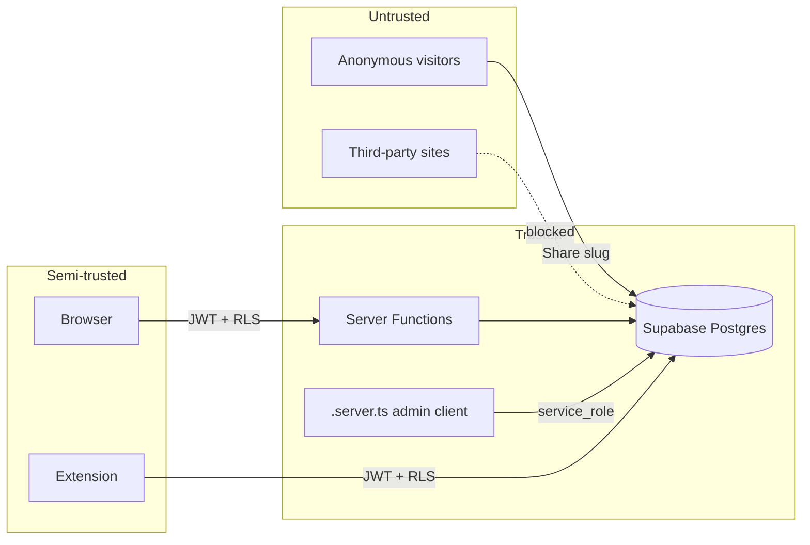

# Security

Security is enforced at four layers: authentication, authorization,
transport, and data. The goal is that a compromised client, extension, or
public share link cannot expose another user's data.

## Threat Model (Summary)

## Authentication

- Supabase Auth issues short-lived JWTs; refresh tokens rotate.
- Providers: email/password and Google OAuth (configurable).
- No anonymous signups. Email confirmation follows project policy.
- The client persists sessions in `localStorage`; the extension mirrors
  the same session via a signed handshake at `/extension`.

## Authorization

- **Row-Level Security everywhere.** Every table in `public` has RLS
  enabled with policies keyed on `auth.uid()`.
- **Roles are stored in `user_roles`, never on `profiles`.** Role checks
  go through the `SECURITY DEFINER` function `public.has_role(uid, role)`
  to prevent recursive RLS lookups and client-side tampering.
- **Server functions run as the caller.** `requireSupabaseAuth`
  middleware constructs a Supabase client bound to the caller's JWT;
  RLS enforces the same rules as direct client access.
- **The service role client bypasses RLS.** It is only loaded inside
  `.server.ts` files, only used for verified webhooks and privileged
  admin flows, and every such flow authorizes the caller first.

## Data Protection

- Publishable keys and anon keys are safe in client code by design.
- The service role key and database password are never exposed to
  clients, logs, or user-visible errors.
- Public share links (`resume_shares`) grant `SELECT` only on unexpired,
  non-revoked rows and never expose the owner's `user_id`.
- `resume_views` accepts anonymous inserts scoped to a valid share slug
  and denies raw reads to anyone other than the resume owner.

## Transport

- HTTPS enforced by Cloudflare on every hosted URL.
- CORS on `/api/graphql` is limited to the methods and headers required
  by the Yoga client; preflight is handled explicitly.
- CSRF is not a concern for the token-based RPC flow (Bearer tokens on
  same-origin `fetch` from JS), but state-changing routes always require
  a valid JWT.

## Input Validation

- Every server function validates its input with Zod inside
  `.inputValidator()` before the handler runs.
- GraphQL inputs are typed at the schema level and further validated in
  resolvers where semantics require it (e.g. cursor decoding, sort field
  whitelists).
- The Chrome extension sanitizes scraped fields and truncates long
  descriptions before inserting into `applications`.

## Secrets Management

- Managed via Supabase; no `.env` commits.
- `process.env.*` is read inside handler bodies, never at module scope
  (Workers inject env per request).
- New secrets are added through the CareerOS secrets tool and referenced
  by name only.

## Auditability

- All AI outputs that mutate user state are persisted (`ai_analyses`,
  `mock_interview_reports`, `career_plans`) with timestamps and user IDs
  so a user can review what the model produced.
- SSR and handler errors are logged server-side; no PII is included in
  user-facing error pages.

## Responsible Disclosure

Security issues discovered by the automated scanner are triaged inside
CareerOS and remediated as scoped migrations. Findings intentionally
ignored are recorded in the security memory with justification.
